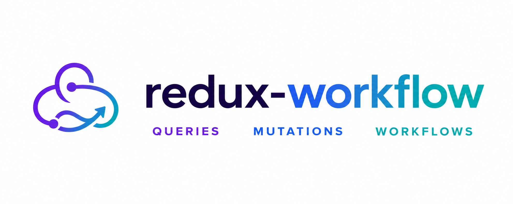

<div align="center">
  <p>
    <strong>One Redux API for queries, mutations, and async workflows.</strong>
    <br/>
    Built on top of
    <a href="https://redux-toolkit.js.org">Redux Toolkit</a>
    and
    <a href="https://redux-saga.js.org/">Redux Saga</a>.
  </p>

  <p>
    <a href="./LICENSE"></a>
    
    
  </p>
</div>

<pre>
⚠️ Work in progress. APIs and packages are subject to change.
</pre>

- **Queries** — cached, deduped reads.
- **Mutations** — writes that invalidate the cache.
- **Workflows** — orchestration: listen to actions, compose queries/mutations, cancel cleanly.

## Packages

| Package                         | Description                                                |
| ------------------------------- | ---------------------------------------------------------- |
| `@redux-workflow/core`          | Framework-agnostic. Queries, mutations, workflows.         |
| `@redux-workflow/react`         | React bindings (`useQuery`, `useMutation`, `useWorkflow`). |
| `@redux-workflow/eslint-plugin` | Lint rules (e.g. enforces `yield*`).                       |

## Install

```bash
# pnpm
pnpm add @redux-workflow/react @reduxjs/toolkit redux-saga
```

```bash
# yarn
yarn add @redux-workflow/react @reduxjs/toolkit redux-saga
```

```bash
# npm
npm install @redux-workflow/react @reduxjs/toolkit redux-saga
```

`@redux-workflow/core` is pulled in transitively. `react` and `react-redux`
are peer dependencies — install them only if your project doesn't already
have them.

For a non-React project, install `@redux-workflow/core` instead of
`@redux-workflow/react`.

## Quickstart

```ts
import { configureStore, combineReducers } from '@reduxjs/toolkit';
import createSagaMiddleware from 'redux-saga';
import { createApi } from '@redux-workflow/core';

const usersApi = createApi({
  name: 'usersApi',
  queries: (query) => ({
    getUser: query({
      async execute({ id }: { id: string }) {
        const res = await fetch(`/users/${id}`);
        return { data: await res.json() };
      },
      cache: 60,
    }),
  }),
});

const sagaMiddleware = createSagaMiddleware();
const store = configureStore({
  reducer: combineReducers({ [usersApi.reducerPath]: usersApi.reducer }),
  middleware: (getDefault) => getDefault().concat(sagaMiddleware),
});
sagaMiddleware.run(usersApi.rootSaga);
```

```tsx
import { useQuery } from '@redux-workflow/react';

function UserCard({ id }: { id: string }) {
  const { data, isLoading } = useQuery(usersApi.queries.getUser, { id });
  if (isLoading) return <Spinner />;
  return <div>{data.name}</div>;
}
```

## Workflow example

Workflows orchestrate multi-step async work. They can call queries and
mutations, dispatch actions, listen to domain events, and cancel cleanly.

```ts
import { createApi } from '@redux-workflow/core';

const checkoutApi = createApi({
  name: 'checkoutApi',
  queries: (query) => ({
    fetchCart: query({
      async execute({ cartId }: { cartId: string }) {
        const res = await fetch(`https://api.website.com/carts/${cartId}`);
        return { data: await res.json() };
      },
    }),
  }),
  mutations: (mutation) => ({
    pay: mutation({
      async execute({ cartId }: { cartId: string }) {
        const res = await fetch(`https://api.website.com/carts/${cartId}/pay`, { method: 'POST' });
        return { data: await res.json() };
      },
      invalidates: ['fetchCart'],
    }),
  }),
  workflows: (workflow) => ({
    checkout: workflow({
      *execute({ cartId }: { cartId: string }, { query, mutate }) {
        const cart = yield* query('fetchCart', { cartId });

        if ('error' in cart) return { error: cart.error };

        if (cart.data.items.length === 0) {
          return { error: new Error('empty cart') };
        }

        return yield* mutate('pay', { cartId });
      },
    }),
  }),
});

export const { useFetchCart, useCheckoutWorkflow } = createReactHooks(checkoutApi);
```

Trigger it from a component with `useWorkflow`:

```tsx
import { useQuery, useWorkflow } from '@redux-workflow/react';

type CheckoutProps = {
  cartId: string;
};

function Checkout({ cartId }: CheckoutProps) {
  const { data: cart, isLoading: isCartLoading } = useFetchCart({ cartId });
  const [checkout, { isLoading, isSuccess }] = useCheckoutWorkflow();

  if (isCartLoading) return <Spinner />;

  return (
    <div>
      <ul>
        {cart.items.map((item) => (
          <li key={item.id}>
            {item.name} — ${item.price}
          </li>
        ))}
      </ul>
      <button disabled={isLoading} onClick={() => checkout({ cartId })}>
        {isSuccess ? 'Paid' : `Pay (${cart.items.length} items)`}
      </button>
    </div>
  );
}
```

`useQuery` hits the same cache that `checkout` reads inside `*execute`, so
the workflow's `query('fetchCart', ...)` returns immediately if the
component already loaded it.

## Documentation

Not yet published. Run `pnpm start` and choose `launch-website`

<!--

Full docs live at **[redux-workflow.dev](https://redux-workflow.dev)** (or run
`pnpm --filter @redux-workflow/website start` locally).

- [Getting started](https://redux-workflow.dev/docs/) — install + setup
- [Return shape](https://redux-workflow.dev/docs/return-shape) — `{ data }` / `{ error }` and the async-vs-generator choice
- [Queries](https://redux-workflow.dev/docs/queries) — caching, polling, `httpQuery`, focus/reconnect refetch
- [Mutations](https://redux-workflow.dev/docs/mutations) — invalidation, optimistic updates
- [Workflows](https://redux-workflow.dev/docs/workflows) — orchestration, streaming, cancellation
- [Hooks reference](https://redux-workflow.dev/docs/hooks) — `useQuery`, `useLazyQuery`, `useMutation`, `useWorkflow`
- [Architecture](https://redux-workflow.dev/docs/architecture) — circular-import patterns, recipes
- [Testing](https://redux-workflow.dev/docs/testing) — `setupApiTest` + chainable assertions
- [Publishing](https://redux-workflow.dev/docs/publishing) — release flow with Changesets

 -->

## Contributing

Run from the repo root:

```bash
pnpm install
pnpm test
pnpm lint
pnpm build
```

See [CLAUDE.md](./CLAUDE.md) for tooling notes (build pipeline, lint config,
changesets workflow).

## Testing locally in another project

To try unpublished changes from a consumer app, build the packages and install
them as tarballs. This mirrors exactly what npm would publish, so behavior
matches a real release.

```bash
# 1. Build the packages you want to test (core is required for react).
pnpm --filter @redux-workflow/core build
pnpm --filter @redux-workflow/react build

# 2. Pack them — produces a .tgz next to each package.json.
pnpm --filter @redux-workflow/core pack
pnpm --filter @redux-workflow/react pack
```

Then in your consumer app:

```bash
pnpm add /absolute/path/to/redux-workflow/packages/core/redux-workflow-core-0.1.0.tgz
pnpm add /absolute/path/to/redux-workflow/packages/react/redux-workflow-react-0.1.0.tgz
```

The version suffix in the filename matches each package's current `version`.
Re-run `build` + `pack` + `pnpm add` after every change, or wire it up as a
quick script.

### Faster iteration with `pnpm link`

If you're iterating quickly and don't need the published-package semantics,
symlink the local packages from your consumer app. With pnpm 10, run `pnpm
link` **from the consumer**, passing the absolute path to each package
directory (no `--global`, no `--filter`):

```bash
# In your consumer app.
pnpm link /absolute/path/to/redux-workflow/packages/core
pnpm link /absolute/path/to/redux-workflow/packages/react
```

You still need to run `pnpm --filter @redux-workflow/core build` after
editing core, because `@redux-workflow/react` resolves core through `dist/`,
not the TypeScript source. **Heads-up:** linking with `react` /
`react-redux` peer dependencies sometimes loads two copies of React — if you
hit `Invalid hook call` errors, switch back to the `pack` flow.

To unlink, run `pnpm unlink <package>` (or just `rm -rf node_modules` and
reinstall) in the consumer.
